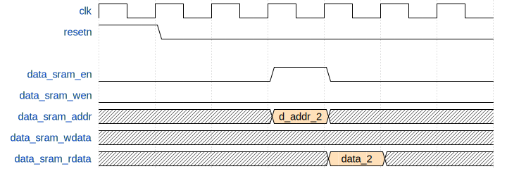
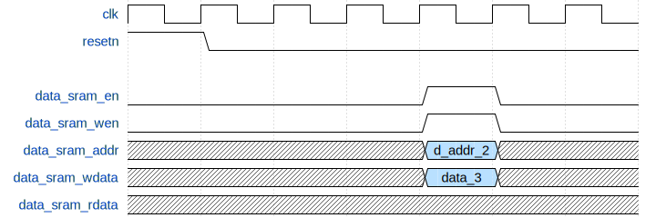
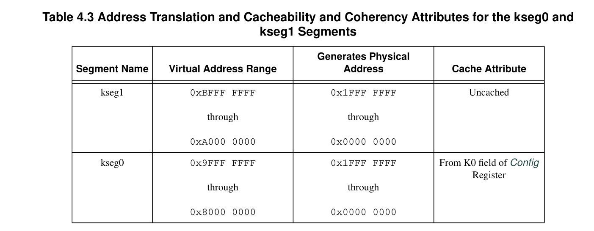
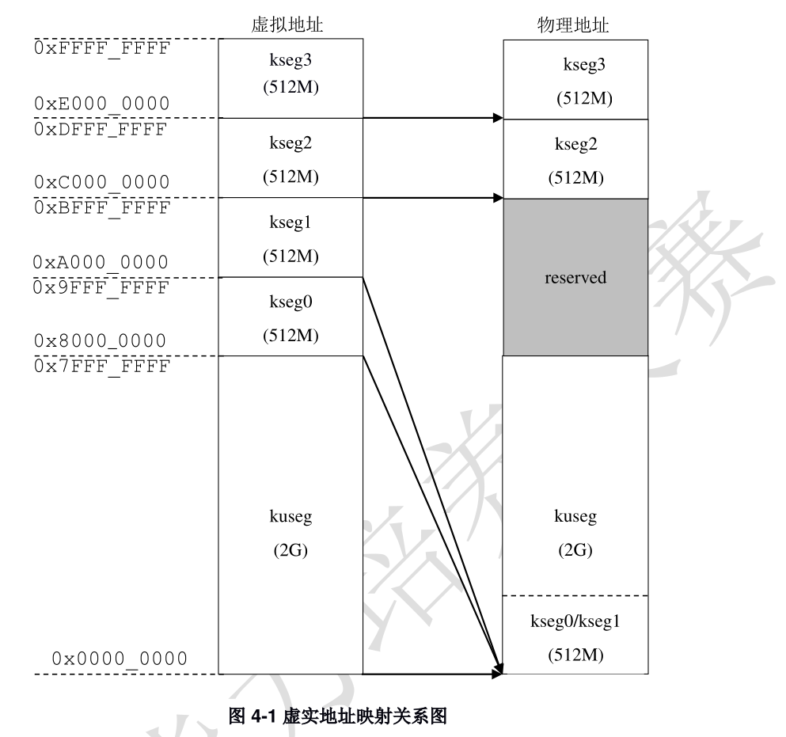

# 流水线 CPU SOC 接口规范

**如果你当前的 CPU 架构中实现访存是没有延迟的，那么你可以直接使用 lab3 进行测试。然后再考虑修改架构以适应 lab5。**

### 整体架构
本实验整个项目工程的架构图如下：


其中，做实验时只需要完成 myCPU 部分的代码即可，其他部分代码已补充完毕。在实现 myCPU 时需要将其最终的对外接口符合下面的接口定义。

**关于数据存取：**

MIPS 架构是一个统一编址的指令集架构，即没有 `IN`、 `OUT` 这类访问外设的指令。MIPS 架构是将地址空间中的一部分地址分配给 I/O 端口，这样在访问外设时跟访问数据存储器是相同的操作，即都是使用 LW、LW 这类访存指令来访问，因此读写外设和数据存储器是没有区别的。

因而上述架构图中会有一个 `bridge` 模块，该模块是用来确定读写的是数据存储器还是外设。该模块的工作原理就是通过地址来区分，本实验中，设定外设的地址空间是 **`0xbfaf_0000 ~ 0xbfaf_ffff`**，因此，当访存指令给出的访问地址是在该范围内时即说明要访问外设，`bridge` 会控制外设读写而不是数据存储器，反之亦然。 


## 对 CPU 进行修改

1. 修改顶层模块接口并对接接口时序
2. 修改内存映射
3. 修改 `PC` 初始化地址

### 接口定义

myCPU 模块对外接口如下：

| 信号              | 方向   | 位宽 | 含义                                                                                                              |
| -                 | -      | -    | -                                                                                                                 |
| resetn            | input  | 1    | 复位信号（低使能）                                                                                                |
| clk               | input  | 1    | 时钟信号                                                                                                          |
| int               | input  | 6    | 中断信号（高使能，本实验中可以忽略）                                                                              |
|                   |        |      |                                                                                                                   |
| inst_sram_en      | output | 1    | 指令通道使能                                                                                                      |
| inst_sram_wen     | output | 4    | 是否写数据（总为 `4'b0000`）                                                                                      |
| inst_sram_addr    | output | 32   | 指令地址                                                                                                          |
| inst_sram_wdata   | output | 32   | 写入的数据（不需要）                                                                                              |
| inst_sram_rdata   | input  | 32   | 读取的指令                                                                                                        |
|                   |        |      |                                                                                                                   |
| data_sram_en      | output | 1    | 数据通道使能                                                                                                      |
| data_sram_wen     | output | 4    | 写入地址的有效字节，比如 `4'b1111` 表示 32 位全有效、 `4'b0001` 只会写入最低 8 位                                 |
| data_sram_addr    | output | 32   | 数据地址                                                                                                          |
| data_sram_wdata   | output | 32   | 写入的数据（只有 data_sram_wen 为 1 时有意义）                                                                    |
| data_sram_rdata   | input  | 32   | 读取的数据                                                                                                        |
|                   |        |      |                                                                                                                   |
| debug_wb_pc       | output | 32   | 写回级(多周期最后一级)的 PC,因而需要在你的 CPU 里将 PC 一路带到写回级                                             |
| debug_wb_rf_wen   | output | 4    | 写回级写寄存器堆(regfiles)的写使能,为字节写使能,如果 mycpu 写 regfiles 为单字节写使能,则将写使能扩展成 4 位即可。 |
| debug_wb_rf_wnum  | output | 5    | 写回级写 regfiles 的目的寄存器号                                                                                  |
| debug_wb_rf_wdata | output | 32   | 写回级写 regfiles 的写数据                                                                                        |

控制信号主要为 `rst` 和 `clk` 信号，其中一个提供低使能的复位信号，一个提供时钟信号以同步 CPU。

在取指这一部分有三个主要信号，`inst_sram_en` 作为使能，控制 sram 是否读取指令。 `inst_sram_addr` 提供当前需要取出的指令的地址，这是一个 32 位的地址，而 `inst_sram_rdata` 是**有一周期延迟**下取回的指令数据，也是 32 位（MIPS 指令是定长指令，都是 32 位）。

在访存部分有如下几个信号，`data_sram_en` 作为使能，控制 sram 是否读取或写入数据。 `data_sram_addr` 提供访存的地址，加载和存储指令复用该信号作为访存地址。`data_sram_wdata` 提供存储指令将要存储的数据，当访存指令为加载指令时该信号不起作用。`data_sram_wen` 在访存指令为存储指令时置高电平，表示将写存储器，其他情况置低电平。`data_sram_rdata` 是访存指令为加载指令时**延迟一个周期**返回的一个加载数据，即 LW 等指令从存储器中读取到的数据。

最后四个信号（以 `debug_` 开头）是用于仿真环境的自动对比测试使用，它不需要你额外增加 CPU 功能，只需要将内部信号牵引出来（注意是回写级）。

下图分别展示了取指，读取数据，写入数据对相应接口的操作（**注意图与图之间并没有关联，本图只是表达同一组接口的信号的延迟情况**）：






在写内存时，因为没有需要接收的返回的信号，所以图中的只有一个周期画出了信号。**写入内存时，不需要暂停流水线。**

### 修改内存映射

#### TL;DR

在数据和指令地址送出之前，把最终的地址高三位抹 0 就行。

```
// e.g.
0xbfc0_0000 -> 0x1fc0_0000
```


#### 更多解释

如果你阅读了 `bridge_1x2.v`（用于判定访存是走的外设还是数据存储器） 的代码，你会发现如下定义：

```verilog
`define CONF_ADDR_BASE 32'h1faf_0000
`define CONF_ADDR_MASK 32'hffff_0000

// ...

assign sel_conf = (cpu_data_addr & `CONF_ADDR_MASK) == `CONF_ADDR_BASE;

// ...

always @ (posedge clk) begin
    if (reset) begin
        sel_sram_r <= 1'b0;
        sel_conf_r <= 1'b0;
    end else begin
        sel_sram_r <= sel_sram;
        sel_conf_r <= sel_conf;
    end
end

assign cpu_data_rdata = {32{sel_sram_r}} & data_sram_rdata
                          | {32{sel_conf_r}} & confreg_rdata;
```


为什么用于比较的 `CONF_ADDR_BASE` 不是 `0xbfaf_0000` 而是 `0x1faf_0000`。

原因在于 MIPS 规范中的内存地址映射。




以上两图中的虚拟地址是 CPU 内部的地址，而物理地址是送出顶层模块的地址。

本 SOC 遵守 MIPS 规范考虑到了地址映射，因此 CPU 编写者也需要注意进行转换。

### 修改 `PC` 初始化地址为 `0xbfc0_0000`

也就是当 `resetn` 使能的时候， `PC` 回到 `0xbfc0_0000` 而不是 `0x0000_0000`。
